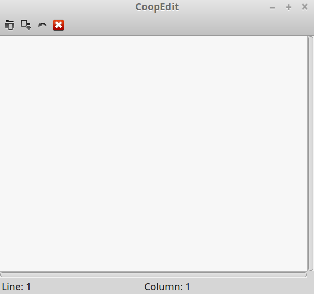

# Editeur-de-fichiers

# INTRODUCTION
Distributed and Cooperative File Editor is a file editor that will help different users to open, read and modify a file that is stored on server, in real time.
Language C. UI : GTK API. 

# BUILDING
	-	git clone https://github.com/DilaraOflazoglu/Editeur-de-fichiers.git
	-	cd Editeur-de-fichiers/src
	
	
# Server Code
	-	cd server
Launch the server:   
&nbsp; &nbsp; &nbsp;-&nbsp; &nbsp; &nbsp;make test-server  
&nbsp; &nbsp; &nbsp;-&nbsp; &nbsp; &nbsp;OR make THEN ./bin/server Socket_Port_1 Socket_Port_2  

# Client Code
	-	cd client
Launch the client:   
&nbsp; &nbsp; &nbsp;-&nbsp; &nbsp; &nbsp;make test-client  
&nbsp; &nbsp; &nbsp;-&nbsp; &nbsp; &nbsp;OR make THEN ./bin/client Socket_Port_1 Socket_Port_2    
	
NOTE 1 : CLIENT Socket_Port_1 and SERVER Socket_Port_1 must be the same.  
NOTE 2 : CLIENT Socket_Port_2 and SERVER Socket_Port_2 must be the same.   
NOTE 3 : Socket Port numbers must be greater than 1024  

# FEATURES
&nbsp; &nbsp; &nbsp;-&nbsp; &nbsp; &nbsp; Chose a file provided by the server and Open it on User Interface  
&nbsp; &nbsp; &nbsp;-&nbsp; &nbsp; &nbsp; Edit this file  
&nbsp; &nbsp; &nbsp;-&nbsp; &nbsp; &nbsp; Get all other Users who opened this file in Real-Time  
&nbsp; &nbsp; &nbsp;-&nbsp; &nbsp; &nbsp; One user can edit one line at the same time  
&nbsp; &nbsp; &nbsp;-&nbsp; &nbsp; &nbsp; Different Users can not edit the same line, to respect the consistency  
	
	
# USER INTERFACE

